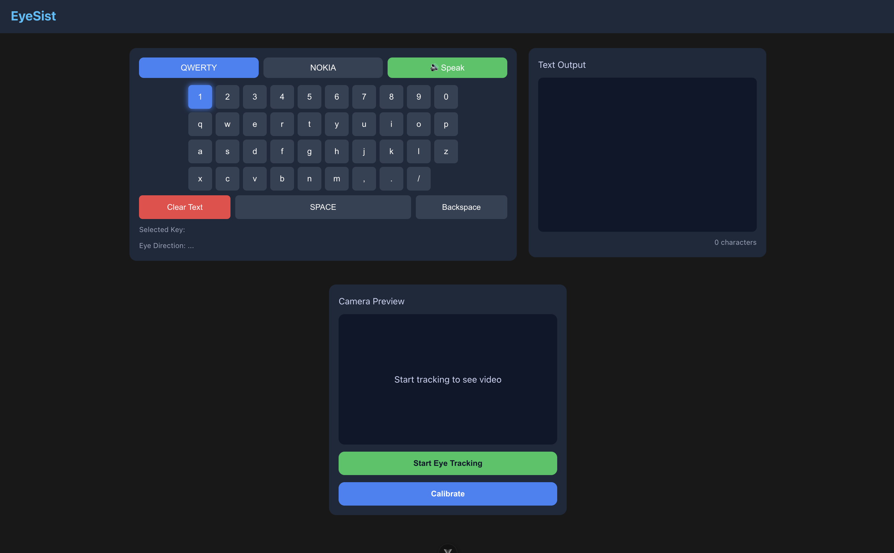

# EyeSist

**A real-time, gaze-controlled communication aid for people with motor disabilities.**

EyeSist lets users type, autocomplete words, and have text spoken aloud — all by looking at a screen. A webcam streams to a FastAPI server that detects eyes with a custom YOLO model, classifies gaze direction (left/right/up/down/straight/closed) using a fine-tuned ResNet-50, and returns results over WebSocket fast enough to drive a keyboard interface in real time. Users personalise the system with a 30-second calibration that fits a per-user Ridge Regression model on top of the shared backbone — no retraining required.

A ClearML MLOps pipeline runs in the background: it accumulates calibration data from users whose eyes the base model struggles with, retrains three candidate architectures in parallel, evaluates them against the production model, and promotes the winner only if it clears a statistical improvement bar.

## Key Features

- **Real-time gaze inference** over WebSocket — per-frame request/response loop with 8-frame majority-vote smoothing
- **Gaze-directed keyboard** — QWERTY and Nokia T9 layouts; navigate by looking up/down/left/right, activate by looking straight
- **Instant personalisation** — Ridge Regression classifier fit on backbone features in under 1 second; immediately active for that session and persisted so returning users can skip calibration
- **Automatic TTS** — Web Speech API, no external service
- **Prefix autocomplete** — client-side, zero-latency, works offline
- **Full MLOps pipeline** — volume-triggered retraining, parallel candidate training, promotion gate, versioned model storage

---

## Demo

[](https://www.youtube.com/watch?v=mq-nGi2ElHg&t=126)

---

## System Architecture

```
┌─────────────────────────────────┐        WebSocket (binary frames)
│  Browser (Vue 3)                │ ──────────────────────────────────►  ┌──────────────────────────────────────┐
│  ├─ Camera.vue (webcam stream)  │                                       │  FastAPI Backend                     │
│  ├─ Keyboard.vue (gaze nav)     │ ◄──────────────────────────────────   │  ├─ YOLO eye detector                │
│  ├─ CalibrationModal.vue        │        JSON {gaze, boxes}             │  ├─ ETH-XGaze ResNet-50 backbone      │
│  └─ Web Speech API (TTS)        │                                       │  ├─ Per-session Ridge classifier      │
└─────────────────────────────────┘                                       │  └─ 8-frame majority-vote smoother   │
                                                                          └──────────────┬───────────────────────┘
                                                                                         │
                                                              ┌──────────────────────────▼──────────────────────────┐
                                                              │  Azure Blob Storage                                  │
                                                              │  ├─ models/backbone/ethxgaze_backbone.pth (prod)     │
                                                              │  ├─ models/backbone/promoted/ethxgaze_v{N}_*.pth    │
                                                              │  ├─ models/ridge/{session_id}.pkl                   │
                                                              │  ├─ calibration-data/{session_id}/{label}/*.jpg     │
                                                              │  ├─ dataset/manifest.json                           │
                                                              │  └─ dataset/last_retrain.json                       │
                                                              └──────────────┬──────────────────────────────────────┘
                                                                             │
                                                              ┌──────────────▼──────────────────────────────────────┐
                                                              │  ClearML Retraining Pipeline (SageMaker)            │
                                                              │  check_retrain → ingest_data                        │
                                                              │    → [train_resnet50 ║ train_mobilenet              │
                                                              │       ║ train_efficientnet] (parallel)              │
                                                              │    → eval_model → get_test_result                   │
                                                              │    → evaluate_promotion → upload_promoted           │
                                                              └─────────────────────────────────────────────────────┘
```

---

## ML / AI Components

### Eye Detection

A custom-trained YOLO model (`yolo26_eye_detector.pt`, via Ultralytics) detects and crops eye regions from each webcam frame. Using a dedicated eye detector rather than a face landmark approach gives tighter crops and handles partial occlusion better.

### Gaze Classification

**Backbone:** ETH-XGaze pretrained ResNet-50, repurposed as a 2048-dimensional feature extractor (the original `fc` layer is never called). Fine-tuned end-to-end on 6 gaze classes: `closed · down · left · right · straight · up`.

**Training regime:** Two-phase fine-tuning —
- Phase 1: backbone frozen, classification head trained from scratch
- Phase 2: backbone unfrozen from a specified layer, differential learning rates (backbone LR = head LR × 0.1), early stopping, ReduceLROnPlateau

### Per-User Personalisation (Ridge Calibration)

During calibration (~100 eye crops per direction), backbone features are extracted and a `RidgeClassifier` + `StandardScaler` scikit-learn pipeline is fitted in under 1 second. This model is stored per session in Azure and loaded on cache miss. Users whose base model accuracy is already ≥ 90% skip image upload — their data adds no training diversity.

---

## MLOps Pipeline

The retraining pipeline runs on ClearML-managed SageMaker agents and is triggered when 5,000+ new training samples have accumulated since the last retrain (from users whose base accuracy was < 90%).

### Pipeline DAG

```
check_retrain
     │
ingest_data  ──── logs original + user dataset counts to ClearML
     │
     ├──── train_resnet50     ─┐
     ├──── train_mobilenet    ─┼── parallel, each with 2-phase fine-tuning
     └──── train_efficientnet ─┘
                │
           eval_model  ──── picks winner by validation accuracy
                │            logs FPS + confusion matrix per candidate
         get_test_result ── evaluates winner on held-out test set
                │
      evaluate_promotion ── compares winner vs current production model
                │            promotes only if delta ≥ 2% absolute accuracy
         upload_promoted ── versions model in Azure, updates manifest
```

### Data Strategy

- **Original dataset** — fixed train/val/test splits, never reassigned
- **User sessions** — assigned to train/val/test at ingestion using a greedy deficit-balancing algorithm (targets: 70/15/15) based on both session count and sample count
- **Expanding window** — all qualifying sessions since system launch are included in each retrain; the trigger counts new samples since the last run

### Experiment Tracking

Every calibration session creates a ClearML task logging `base_accuracy`, `ridge_accuracy`, and per-label sample counts. Pipeline runs log training curves, per-candidate validation accuracy, inference FPS, and confusion matrices. Promoted models are archived with version number, timestamp, and test accuracy delta.

---

## Tech Stack

| Layer | Technology |
|---|---|
| Frontend | Vue 3, Vite |
| Backend | Python 3.12, FastAPI, Uvicorn |
| ML framework | PyTorch 2.11, Torchvision |
| Eye detection | Ultralytics YOLO (custom weights) |
| Personalisation | scikit-learn RidgeClassifier |
| MLOps | ClearML Pipelines |
| Cloud storage | Azure Blob Storage |
| Inference host | Amazon SageMaker |
| TTS | Web Speech API (browser-native) |

---

## Project Structure

```
backend/
├── main.py                  # FastAPI app — WebSocket predict & calibrate endpoints
├── model.py                 # GazeClassifier, ResNet-50, feature extraction, inference
├── eye_detector.py          # YOLO-based eye detection and cropping
├── azure_storage.py         # Azure Blob Storage helpers (models, manifests, sessions)
├── pipeline_helpers.py      # Shared training/eval code imported by pipeline steps
├── runtime_config.py        # Device selection (auto / cpu / cuda / mps)
├── training_config.py       # Hyperparameters, model configs, retrain thresholds
├── requirements.txt
└── pipeline/
    ├── pipeline_controller.py   # ClearML PipelineDecorator — step definitions + DAG
    └── step_calibrate_user.py   # Ridge calibration, split assignment, data upload

frontend/
├── src/
│   ├── components/
│   │   ├── Camera.vue           # Webcam capture + WebSocket streaming
│   │   ├── Keyboard.vue         # Gaze-navigable keyboard (QWERTY + Nokia T9)
│   │   ├── CalibrationModal.vue # Per-label calibration capture flow
│   │   └── TextOutput.vue       # Composed text display
│   └── store/
│       ├── keyboardText.js      # Text state + Nokia multi-tap logic
│       └── dictionary.js        # Static word list for prefix autocomplete
└── package.json
```

---

## Local Setup

### Backend

```bash
cd backend
python3.12 -m venv .venv
source .venv/bin/activate
pip install -r requirements.txt
```

Create a `.env` file in `backend/`:

```env
AZURE_STORAGE_ACCOUNT_NAME=your_account_name
EYESIST_DEVICE=auto          # auto | cpu | cuda | mps
```

```bash
uvicorn main:app --reload
```

### Frontend

```bash
cd frontend
npm install
npm run dev
```

### Retraining Pipeline

```bash
# Run all pipeline steps locally (subprocess isolation, matches ClearML behaviour)
cd backend/pipeline
python pipeline_controller.py --run-local

# Force a run regardless of sample threshold
python pipeline_controller.py --run-local --force

# Dispatch to ClearML agents
python pipeline_controller.py --run-now
```

---

## API Reference

| Method | Path | Description |
|---|---|---|
| `WS` | `/ws/gaze` | Stream frames, receive `{gaze, boxes, frame_size}` per frame |
| `WS` | `/ws/calibration` | Stream eye crops for one label during calibration |
| `POST` | `/sessions/{session_id}/calibration` | Finalise calibration, fit and store Ridge model |
| `GET` | `/health` | Health check |
